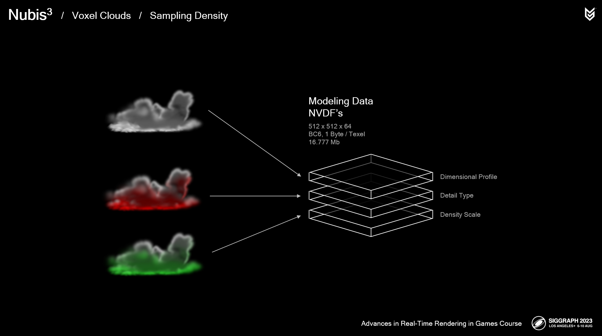
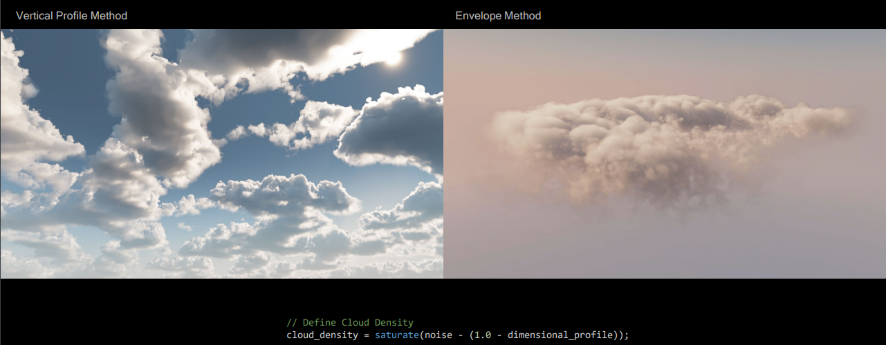
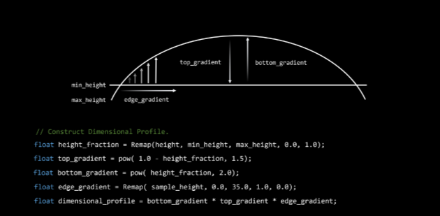
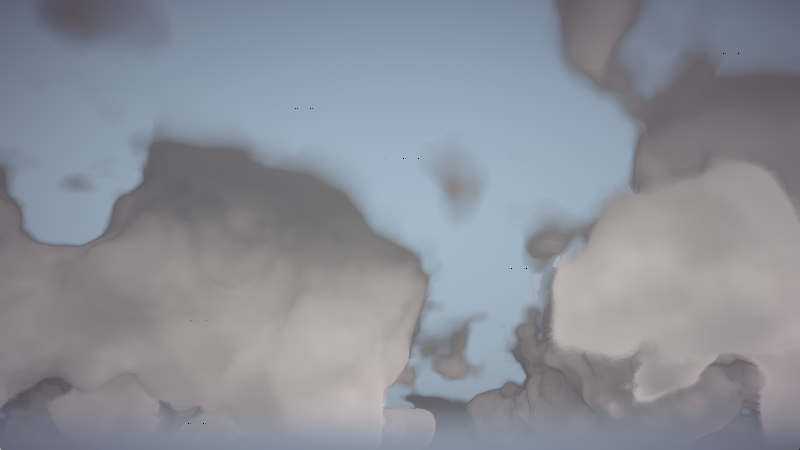

Real-time Volumetric Cloud Rendering in Vulkan
==================================

**University of Pennsylvania, CIS 565: GPU Programming and Architecture, Final Project**

## Project Overview

A realtime vulkan implementation of [*Nubis3: Methods (and madness) to model and render immersive real-time voxel-based clouds*](https://advances.realtimerendering.com/s2023/Nubis%20Cubed%20(Advances%202023).pdf), a highly detailed and immersive voxel-based cloud renderer and modeling approach in SIGGRAPH 2023, Advances in Real-Time Rendering in Games course. In this project, we tried to follow the developing history of Real-Time Volumetric Cloud Generating Solution *Nubis* and its different algorithm in 1, 2 and 3 generation. 


## Feature checklist and progress
- Vulkan pipeline(half from scrach)
    - [x] Compute pipeline (compute the shape of cloud and light raymarching)
    - [x] Graphics pipeline (for post processing and tone mapping, adjusting image storage in compute shader)
    - [ ] Imgui (trouble here! Building it from scratch and didn't show)
- Algorithm implementation
    - [x] Nubis1 and Nubis2 raymarching algorithm (project cloud on a faraway atmosphere)
    - [ ] Nubis3
- Cloud modeling and noise texture generation
    - [ ] Generate profile data
- Post processing
- Interaction with scene
    - [ ] Going through the cloud
    - [ ] Day night cycle

## Installation Instructions

The project is using OpenVDB for modeling data loading. To build the project, here are a few steps to do as prerequisites:

### 1. Install vcpkg

The project uses vcpkg for the installation of OpenVDB and its dependencies. The following steps are specifically for Windows users, if you are using another operating system, please refer to the  [official GitHub page for vcpkg](https://github.com/microsoft/vcpkg).

```
git clone https://github.com/microsoft/vcpkg
cd vcpkg
./bootstrap-vcpkg.bat
```
Check your systen Environment Variables to see if there is a `VCPKG_DEFAULT_TRIPLET` and it should be set to `<path to vcpkg>\installed\x64-windows`.

### 2. Install OpenVDB Dependencies

```
./vcpkg install zlib --triplet=x64-windows
./vcpkg install blosc --triplet=x64-windows
./vcpkg install tbb --triplet=x64-windows
./vcpkg install boost-iostreams --triplet=x64-windows
./vcpkg install boost-any --triplet=x64-windows
./vcpkg install boost-algorithm --triplet=x64-windows
./vcpkg install boost-interprocess --triplet=x64-windows
./vcpkg integrate install
```

### 3. Install OpenVDB

For operating systems other than Windows, refer to the [official GitHub page for OpenVDB](https://github.com/AcademySoftwareFoundation/openvdb).

```
./vcpkg install openvdb --triplet=x64-windows
./vcpkg integrate install
```

## Algorithms and Approaches
### Cloud Modeling
There are two major inputs containing the information to render a cloud. `Modeling Data` stores information defining the overall shape of the cloud, which can be loaded from `.vdb` files and `Cloud 3D Noise` stores the noises that will be used to calculate the details on the cloud, which can be loaded from sequences of `.tga` files. Both of the input data files can be generated from a noise generator as a Houdini Asset provided by Nubis3 team.

#### VDB

VDB is a data structure based on hierarchical voxel grids, which is especially efficient on storing data for model of clouds, smoke, and fire. In this project, we are using `.vdb` generated from the generator mentioned above, which specifically defines 3 channels for purpose of rendering clouds. 

1. `Dimensional Profile`: Construct overall shape and provide gradiant information. 

2. `Detail type`: Describing the distribution of two detail forms, Billow and Wispy, on cloud structures. 

3. `Density Scale`: Providing density modulation.



We use `OpenVDB` to load the `.vdb` file and stores the values of the 3 channels into 3D textures that will be sent to shaders.

#### TGA

As mentioned above, there are two detail forms, `Billow` and `Wispy`. In order to simulate the behavior of the two forms, we use the 3D noises stored in the sequences of `.tga` files. The `.tga` file will be loaded as 3D textures with 4 channels, where each channel stores a specific type of noise. RG solve for `Billow` and BA solve for `Wispy`.

```
R：Low Freq "Curl-Alligator", G:High Freq "Curl-Alligator", B:Low Freq "Alligator", A: High Freq "Alligator"
```

### Cloud Raymarching
We followed Nubis 2 solution first to produce a basic ray marching algorithm, here is the psuedo algorithm here:
```
Psuedo algorithm of cloud density and light energy raymarching
Input: Low-resolution, high-resolution cloud  profile, weather map (coverage, type), curl noise,
1. Raytrace atmosphere to set up start and end point
2. Raymarch cloud density
    2.1 Sample profile density (base density)
        2.1.1 Sample layer density based on cloud type
        2.1.2 Sample profile shape
    2.2 Sample detail density if profile density > 0 to erose density
    2.3 Sample lighting = Direct Scattering + Ambient Scattering 
    2.4 Accumulate density and lighting energy on each step
    2.5 Adjust step size based on profile density
```

Basically, we use the 3D texture produced from Cloud modeling as the sampler of profile density and detail density. In this project, we 're going to implement two profiling method from Nubis 2 and Nubis 3: Envelope Method and Vertical Profile Method. 



#### Envelope Method
The envelope method uses the height of cloud to calculate a packing profile information. All the cloud here is projected to atmosphere, and distributed between inner atmosphere and outer atmosphere. 



The algorithm uses the envelope profile to create a general shape and uses wispy noise and billiowy noise as composite noise to erose the detail of the cloud based on the given cloud type map. Here is the image with only profile density used.



### Environment
