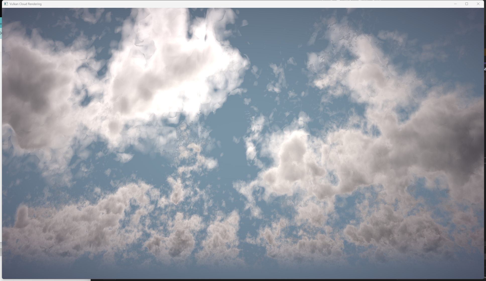

Real-time Volumetric Cloud Rendering in Vulkan
==================================

**University of Pennsylvania, CIS 565: GPU Programming and Architecture, Final Project**

## Project Overview

A realtime vulkan implementation of [*Nubis3: Methods (and madness) to model and render immersive real-time voxel-based clouds*](https://advances.realtimerendering.com/s2023/Nubis%20Cubed%20(Advances%202023).pdf), a highly detailed and immersive voxel-based cloud renderer and modeling approach in SIGGRAPH 2023, Advances in Real-Time Rendering in Games course. 




## Feature checklist and progress
- Vulkan pipeline(half from scrach)
    - [x] Compute pipeline (compute the shape of cloud and light raymarching)
    - [x] Graphics pipeline (for post processing and tone mapping, adjusting image storage in compute shader)
    - [ ] Imgui (trouble here! Building it from scratch and didn't show)
- Algorithm implementation
    - [x] Nubis1 and Nubis2 raymarching algorithm (project cloud on a faraway atmosphere)
    - [ ] Nubis3
- Cloud modeling and noise texture generation
    - [ ] Generate profile data
- Post processing
- Interaction with scene
    - [ ] Going through the cloud
    - [ ] Day night cycle

## Installation Instructions

The project is using OpenVDB for modeling data loading. To build the project, here are a few steps to do as prerequisites:

### 1. Install vcpkg

The project uses vcpkg for the installation of OpenVDB and its dependencies. The following steps are specifically for Windows users, if you are using another operating system, please refer to the  [official GitHub page](https://github.com/microsoft/vcpkg).

```

```

## Algorithms and approaches
### Cloud modeling

### Cloud raymarching
