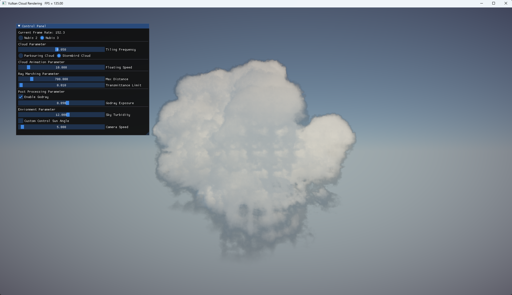
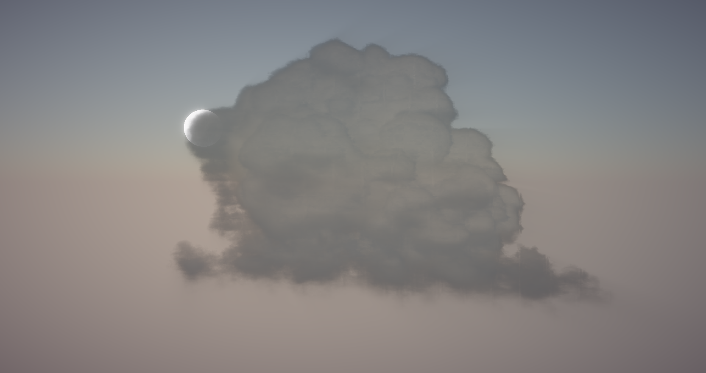
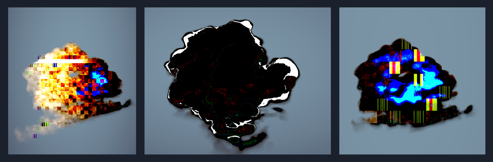
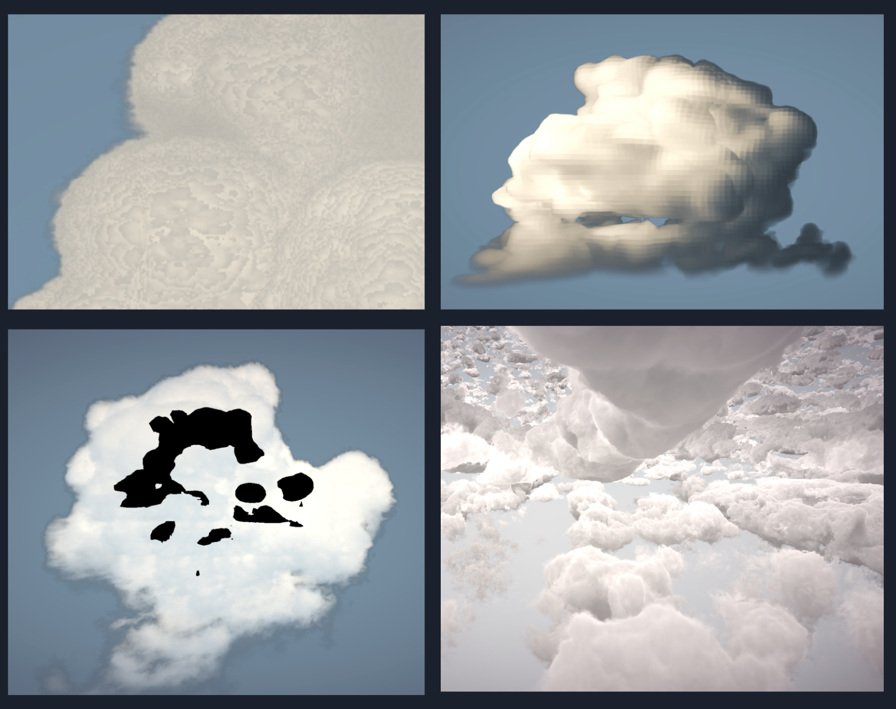

Real-time Volumetric Cloud Rendering in Vulkan
==================================

**University of Pennsylvania, CIS 565: GPU Programming and Architecture, Final Project**
* Janet Wang
* Xinyu Niu: [personal website](https://xinyuniu6.wixsite.com/my-site-1)
* Yue Zhang: [LinkedIn](https://www.linkedin.com/in/yuezhang027/), [personal website](https://yuezhanggame.com/)

## Project Overview

A realtime vulkan implementation of [*Nubis3: Methods (and madness) to model and render immersive real-time voxel-based clouds*](https://advances.realtimerendering.com/s2023/Nubis%20Cubed%20(Advances%202023).pdf), a highly detailed and immersive voxel-based cloud renderer and modeling approach in SIGGRAPH 2023, Advances in Real-Time Rendering in Games course. In this project, we tried to follow the developing history of Real-Time Volumetric Cloud Generating Solution *Nubis* and its different algorithm in 1, 2 and 3 generation. 




[Video demo: Nubis3 cloud](https://youtu.be/DjDdMux2X8Y)
[Video demo: Nubis2 cloud](https://www.youtube.com/watch?v=Ejm8KpYlGQM)

## Feature checklist and progress
- Vulkan pipeline(half from scrach)
    - [x] Compute pipeline (compute the shape of cloud and light raymarching)
    - [x] Graphics pipeline (for post processing and tone mapping, adjusting image storage in compute shader)
    - [x] Imgui 
- Algorithm implementation
    - [x] Nubis1 and Nubis2 raymarching algorithm (project cloud on a faraway atmosphere)
    - [x] Nubis3
        - [x] Cloud density raymarching
        - [x] Cloud light energy raymarching using voxel grid
        - [x] Temperal upscaling
- Cloud modeling and noise texture generation
    - [x] Generate profile data
- Post processing
    - [x] God Ray
- Interaction with scene
    - [x] Going through the cloud
    - [x] Day night cycle

## Installation Instructions

The project is using OpenVDB for modeling data loading. To build the project, here are a few steps to do as prerequisites:

### 1. Install vcpkg

The project uses vcpkg for the installation of OpenVDB and its dependencies. The following steps are specifically for Windows users, if you are using another operating system, please refer to the  [official GitHub page for vcpkg](https://github.com/microsoft/vcpkg).

```
git clone https://github.com/microsoft/vcpkg
cd vcpkg
./bootstrap-vcpkg.bat
```
Check your systen Environment Variables to see if there is a `VCPKG_DEFAULT_TRIPLET` and it should be set to `<path to vcpkg>\installed\x64-windows`.

### 2. Install OpenVDB Dependencies

```
./vcpkg install zlib --triplet=x64-windows
./vcpkg install blosc --triplet=x64-windows
./vcpkg install tbb --triplet=x64-windows
./vcpkg install boost-iostreams --triplet=x64-windows
./vcpkg install boost-any --triplet=x64-windows
./vcpkg install boost-algorithm --triplet=x64-windows
./vcpkg install boost-interprocess --triplet=x64-windows
./vcpkg integrate install
```

### 3. Install OpenVDB

For operating systems other than Windows, refer to the [official GitHub page for OpenVDB](https://github.com/AcademySoftwareFoundation/openvdb).

```
./vcpkg install openvdb --triplet=x64-windows
./vcpkg integrate install
```

### 4. Alter CMakeList

To assist setting up project properties, the CMakeList includes `find_package(OpenVDB REQUIRED)`, which needs a line before it to locate the installed OpenVDB directory. Before building the project, open the CMakeList.txt in the project directory(not the one in /src), change the line 10 to the following:

```
include(<path to vcpkg>\\vcpkg\\scripts\\buildsystems\\vcpkg.cmake)
```
An example would be:
```
include(C:\\vcpkg\\scripts\\buildsystems\\vcpkg.cmake)
```
## Interaction Guide
### Camera Movement
On your keyboard,

```
W - Move forward
S - Move backward
A - Move left
D - Move right
1 - Move up
2 - Move down

Up Arrow - Rotate viewpoint upward
Down Arrow - Rotate viewpoint downward
Left Arrow - Rotate viewpoint leftward
Right Arrow - Rotate viewpoint rightward
```
Press left button and move mouse to rotate camera about the center point of the viewport.

## Pipeline


## Algorithms and Approaches
### 1. Cloud Modeling

The modeling process provides the major inputs for our algorithm. The two inputs are `Modeling Data` that stores the information defining the overall shape of the cloud, which can be loaded from `.vdb` files or sequence of `.tga` files that are sliced from the `.vdb` file, and `Cloud 3D Noise` stores the noises that will be used to calculate the details on the cloud, which can be loaded from sequences of `.tga` files. 


The above figure shows the modeling process Nubis3 team used. The first two steps generates data of 3 main channels and the third step saves the generated data into voxel grids and output the data in a `.vdb` file. For loading, we could either choose to read data from the `.vdb` file or slice the `.vdb` file into sequence of `.tga` files. In this project, we focus on the algorithm with modeling data already prepared, reimplementing the data generation steps will be a whole another project. 

#### VDB
VDB is a data structure based on hierarchical voxel grids, which is especially efficient on storing data for model of clouds, smoke, and fire. In this project, we are using `.vdb` files provided by Nubis3's team that are generated from their internal tools. 

1. `Dimensional Profile`: Construct overall shape and provide gradiant information. 

2. `Detail type`: Describing the distribution of two detail forms, Billow and Wispy, on cloud structures. 

3. `Density Scale`: Providing density modulation.


We use `OpenVDB` to load the `.vdb` file and stores the values of the 3 channels into 3D textures that will be sent to shaders.

#### TGA
The detail erosion part needs to consider two kinds of cloud uplift, one is the upward uplift process encountering cold air will be subjected to a kind of reverse squeezing pressure, which formed the upper part of the cloud wave structure, we call it `Billow`; the other is the cloud body to the low-density space emanation to form a wisp of flocculent structure, we call it `Wispy`. 

Cloud uplift will be affected by the two kinds of effects simultaneously. The cloud uplift process is affected by both effects, so the cloud body will be characterized by both `Billow` and `Wispy`. To simulate this effect on the new monolithic cloud, we use a 4-channel 3D texture with a resolution of 128 * 128 * 128 and RGBAs storing R: Low Freq "Curl-Alligator", G: High Freq "Curl-Alligator", B: Low Freq "Alligator", A: High Freq "Alligator". RG solve for `Billow` and BA solve for `Wispy`. The 3D noise are stored in sequence of `.tga` file, which can be generated from a provided Houdini asset.


### 2. Cloud Raymarching
We followed Nubis 2 solution first to produce a basic ray marching algorithm, here is the psuedo algorithm here:
```
Psuedo algorithm of cloud density and light energy raymarching
Input: Low-resolution, high-resolution cloud  profile, weather map (coverage, type), curl noise,
1. Raytrace atmosphere to set up start and end point
2. Raymarch cloud density
    2.1 Sample profile density (base density)
        2.1.1 Sample layer density based on cloud type
        2.1.2 Sample profile shape
    2.2 Sample detail density if profile density > 0 to erose density
    2.3 Sample lighting = Direct Scattering + Ambient Scattering 
    2.4 Accumulate density and lighting energy on each step
    2.5 Adjust step size based on profile density
```

#### Density
In each step of the ray passing through the scene, the algorithm would check how it intersects with the voxelized cloud. At each point, the algorithm would cumulate the profile density and detailed density of cloud. These two data are used in generating a outlook of the cloud and accumulating light energy (discussed in Cloud Light Energy section).

We use the vdb file produced from cloud modeling section to provide a base profile description of the cloud model we would like to display in the game world. It contains data of the predetermined cloud type and cloud profile density, which acted as the base density of the cloud.  


With the profile defined, we used the 3D texture noise generated by Nubis Noise Generator to simulate the billowy and wispy effect for the cloud, which acts as a value erosion to the basic shape. The type of cloud should be adjusted by different 3D noise in Houdini modeling section.


#### Raymarching acceleration
##### Adaptive Step Size
In constrast to Nubis 2 and other previous raymarching method implemented, we employed an adaptive stepsize where the size of the steps increased over the distance from the camera from Nubis 3. This resulted in fewer samples farther from camera where less precision was needed.

Aside from this, we also read from the SDF generated from Cloud Modeling section to take a big step across the scene outside from the cloud, which increases the cloud sampling hit times.


##### Temperal Upscaling
We used `temporal upscaling` and split the render into two passes: High resolution in the distance to prevent aliasing and low resolution up close to improve performance for the most expensive parts of the ray-march. Since raymarching will get a bigger size far away from camera, the cost is mainly acculumated near the camera.

We set a threshold in 200-500 meter to test how the acceleration method improves the two renders in frame rate and in outlook. It shows that the blurriness is tolerable with only 1/4 its origin work load with a 30% - 70% FPS increase differs from cloud distance from camera.


To be specific, we split the cloud calculation into 2 compute shaders, one for clouds closer than the distance threshold, another one for the farther clouds. The first compute shader runs in 1/4 resolution, and stores the density and color information of close clouds in storage textures. Then, in second shader, we ray march the far clouds, and integrate them with information got from storage textures to get the final results. Below is what it is like when only running the close cloud pass.


### 3. Cloud Lighting
Along with the density calculated in every step, the corresponding light energy at this point should be integrated into pixel data.

For light energy calculation at each point, we mainly followed the formulas provided in Nubis slides:

Light Energy = Direct Scattering + Ambient Scattering. 
- Direct Scattering, which represents all of the light energy coming from the sun. 
- Ambient scattering which represents the light energy coming from the sky and neighboring clouds.

Direct scattering at a given sample point in a cloud as a function of three probabilities: Transmittance, Scattering phase, and multiple scattering. 
- Transmittance is a measure of the amount of light at a given depth in an optical medium (defined by The Beer-Lambert Law). This calculation is mainly based on the accumulated density from the sampling position to the light source.
- Scattering phase is a measure of how much of the energy that reached the sample position will scatter toward our eyes, given the view vector and light vector. Light scatters in a cloud as it refracts through tiny water droplets or ice. In clouds light has a tendency to scatter more along the original path, so we use several Henyey Greenstein phase functions to produce an effect that is art directable and somewhat physically based. 
- Multiple scattering describes light that scatters-in to our view vector after refracting around from multiple encounters with water molecules. We use our dimensional profile as the basis of a probability field to describe where in-scattering happens more frequently because the deeper you are in a cloud, the more potential there is that photons have scattered from their original path. We attenuate this field using another beer-lambert attenuation curve as the multiple scattered light itself is eventually absorbed the more it scatters. We also attenuate this over height to account for the fact that less light scatters into the cloud from below. 
- Finally, we scale this by a phase function to ensure that it too is directional.

Ambient scattering is much simpler and is mainly based on the dimensional profile.

However, the Nubis team did not provide much information about how to accumulate light energy got from each ray marching step, how to combine light energy with cloud color, and how to add the ambient color on this exactly. Thus, for this part we referenced some formulas used in an [volume cloud article](https://zhuanlan.zhihu.com/p/248406797), as well as defined some calculation formulas by ourselves. We are not sure if it is physical enough, but we tried our best to polish the visualization. 


#### Light Density Voxel 
As mentioned before, for some terms in direct scattering, an significant value is the accumulated density from the sampling position to the light source. In the past approahces in Nubis1&2, we compute another ray marching from the point to the lighting position, which is very time costing. The main improvement in Nubis3 for voxel cloud is to integrate a seperable compute pass to pre-compute a 256x256x32 voxel grid of density. The voxel stored the density accumulated from this voxel to the light source. This reduced the render time by about 30% - 40% with a perfect result.


Here is the visualization of light voxel grid in computation:


The light voxel grid also makes the convenient calculation of ambient possible, which was not added in Nubis2:
| Without ambient | With ambient |
|---|---|
|||

#### Physical Sky
For more realistic cloud and environment color, we implemented the Preetham Sky Model which is our day night cycle, and integrated sky color with clouds as ambient color. Also, the stars at night are added using a 2D noise. The turbidity parameter and sun position can be adjusted in UI to customize the environment light condition.
[Preetham Paper](http://www.cs.utah.edu/~shirley/papers/sunsky/sunsky.pdf), [Parameter Reference](https://tw1ddle.github.io/Sky-Shader/)



### 4. Post Process - God Ray
Given the initial image, sample coordinates are generated along a ray cast from the pixel location to the screen-space light position. The light position in screen space is computed by the standard world-view-project transform and is scaled and biased to obtain coordinates in the range [-1, 1]. Successive samples are scaled by both the weight constant and the exponential decay attenuation coefficients for the purpose of parameterizing control of the effect. The separation between samples' density may be adjusted and as a final control factor, the resulting combined color is scaled by a constant attenuation coefficient exposure.
[Followed the Nvidia tutorial](https://developer.nvidia.com/gpugems/gpugems3/part-ii-light-and-shadows/chapter-13-volumetric-light-scattering-post-process)


## Presentation Links
- [Project Pitch](https://docs.google.com/presentation/d/1VOMosNU_EgrPEqzJs6yzk-R75hBktUoOgqSBxD7Gg1A/edit?usp=sharing)
- [Milestone 1](https://docs.google.com/presentation/d/1872T08XeM0K2bhqGDDScZlcGofVLVaUyqmZzWO_yglI/edit?usp=sharing)
- [Milestone 2](https://docs.google.com/presentation/d/1wFTfbSigIz__fvNHlOguQYopze7aLLh6hH-7Y6fjUNI/edit?usp=sharing)
- [Milestone 3](https://docs.google.com/presentation/d/1-MPiJB4ThtBWCuFQ-zqMigMeZ46IL_kjuE15Q48rOIw/edit?usp=sharing)
- [Final Presentation](https://docs.google.com/presentation/d/1xSfqEm1FDfcjGJ_dH2waGBWQiV-ixYy3k29Oyn18iyM/edit?usp=sharing)

## Third Party Credit
- [Nubis Presentation](https://advances.realtimerendering.com/s2023/Nubis%20Cubed%20(Advances%202023).pdf)
- [OpenVDB Official Site](https://www.openvdb.org/)
- [Camera Reference](https://blog.csdn.net/weixin_42376458/article/details/113797354)

## Bloopers



